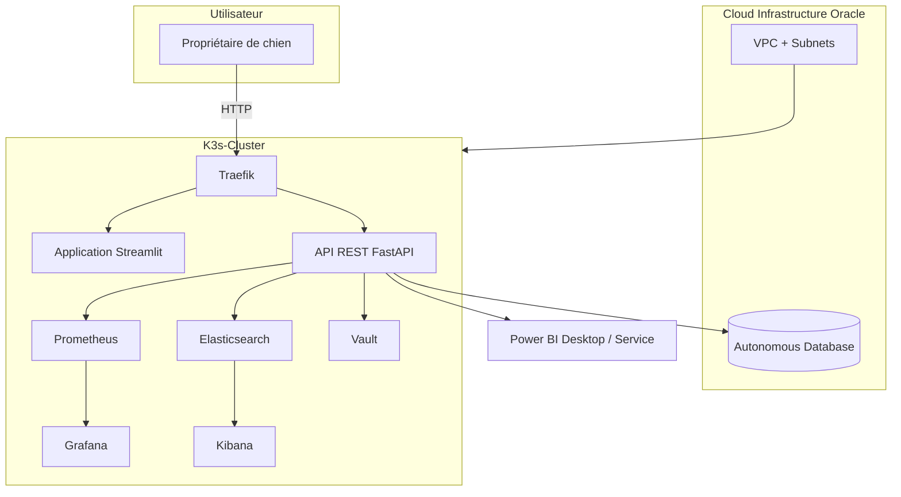

# ☁️ Infrastructure cible – V2 Cloud

Cette section décrit une architecture cloud scalable pour une future version déployée du projet.

---

## 🔧 Diagramme d'architecture (Mermaid)

---

## 📁 Dossier /infra

Contenu prévu :
- terraform/main.tf → création de VPC, réseau, storage, cluster K3s
- terraform/outputs.tf, variables.tf, providers.tf
- README.md
- Diagramme Mermaid

## 🌐 Technologies prévues

- Terraform : provisioning de toute l'infrastructure cloud (réseau, stockage, compute…)
- Oracle Cloud : provider principal (Compute, VCN, Autonomous Database)
- K3s : orchestration Kubernetes légère, adaptée aux petites architectures
- Vault : gestion centralisée des secrets et credentials
- Elasticsearch : stockage et indexation des logs applicatifs et recherches full-text
- Kibana : visualisation des logs
- Prometheus : monitoring des performances de l’API, base de données, containers…
- Grafana : dashboards visuels à partir des données Prometheus

## 🔍 Observabilité

L’observabilité est divisée en deux volets :
- Logs structurés avec Elasticsearch + Kibana
- Métriques de monitoring avec Prometheus + Grafana

Cela permet de couvrir à la fois :
- Le suivi des erreurs, comportements utilisateurs et logs applicatifs (ELK)
- Les performances, temps de réponse, ressources système (Prometheus)
