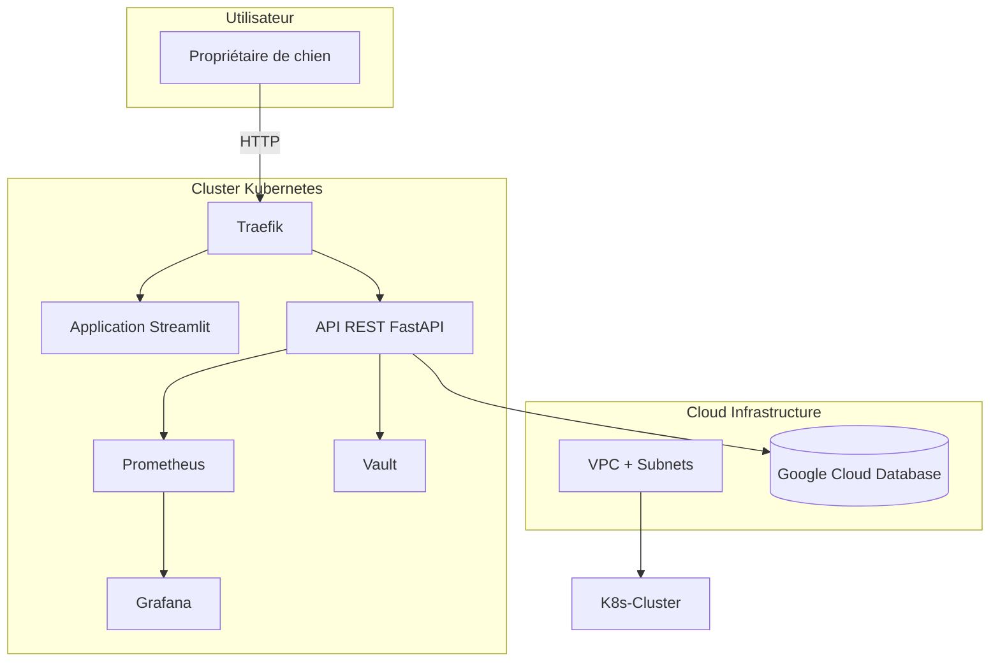

# Infrastructure cible – V2 Cloud

Cette section décrit une architecture cloud évolutive, pensée pour un déploiement de production futur du projet. Elle repose sur une infrastructure cloud basée sur Google Cloud Platform (GCP), avec un cluster Kubernetes (GKE) configuré pour héberger des services applicatifs, et des outils DevOps/Data pour l'observabilité, la sécurité et l’analyse (Streamlit, FastAPI, Prometheus, Grafana, Vault, etc.).

---

## Diagramme d'architecture (Mermaid)


---

## Dossier /infra

Ce dossier contient la définition de l’infrastructure as code pour déployer l’environnement cloud.

```bash
infra/
│
├── main.tf               # Déclaration principale (VCN, compute, DB, K8s, etc.)
├── variables.tf          # Paramètres configurables de l'infra
├── outputs.tf            # Variables de sortie utiles (IP publiques, URLs, etc.)
├── providers.tf          # Configuration du provider Google Cloud
├── cert-manager
│   ├── certificate.yaml
│   └── cluster-issuer.yaml
├── k8s
│   ├── fastapi
│   │   ├── deployment
│   │   ├── fastapi-secret
│   │   ├── fastapi-secret-example
│   │   ├── ingress
│   │   └── service
│   ├── prometheus-grafana
│   │   ├── grafana
│   │   └── prometheus
│   ├── streamlit
│   │   ├── deployment
│   │   ├── ingress
│   │   └── service
│   └── traefik
│       ├── ingress
│       ├── namespace
│       ├── traefik-deployment
│       └── traefik-service
├── vault
│   ├── namespace.yaml
│   ├── vault-deployment.yaml
│   └── vault-service.yaml
└── README.md             # Documentation de l’infrastructure (ce fichier)
```

## Technologies prévues

| Outil         | Rôle                                                                 |
|------------------|------------------------------------------------------------------------|
| **Terraform**    | Provisioning automatisé de l'infrastructure (réseau, compute, DB…)     |
| **GCP (GKE)** | Fournisseur cloud principal (VCN, Autonomous DB, compute instances)     |
| **K8s/GKE**          | Cluster Kubernetes léger pour orchestrer les services applicatifs       |
| **Traefik**      | Ingress Controller pour router les requêtes HTTP/HTTPS                  |
| **Vault**        | Gestion sécurisée des secrets et des credentials                        |
| **Prometheus**   | Collecte des métriques système et applicatives                          |
| **Grafana**      | Tableaux de bord pour visualiser les métriques                          |

### Observabilité

**Métriques système et app :**
- Prometheus collecte des métriques en temps réel (CPU, mémoire, requêtes HTTP…).
- Grafana affiche ces métriques dans des dashboards personnalisables.

**Sécurité et secrets :**
- Vault est utilisé pour gérer les tokens d'accès API, credentials base de données, secrets d'applications, etc.
- Accès sécurisé aux endpoints via Traefik, avec possibilité d’ajouter un certificat TLS auto-géré ou via cert-manager.

### Réseau, ports exposés et accès

| Composant   | Port | Description   |
|----------------|--------|------------------------------------------------------------------|
| **Traefik**     | 80     | HTTP (accès public aux services via Ingress)                    |
|                | 443    | HTTPS (avec TLS si cert-manager est activé)                      |
| **Streamlit**   | —      | Application frontend accessible via Traefik                     |
| **FastAPI**     | —      | API backend accessible via Traefik                              |
| **Grafana**     | 3000   | Interface web pour les dashboards                               |
| **Vault**       | 8200   | Interface UI et API REST de Vault                               |
| **Prometheus**  | 9090   | Interface de visualisation et requêtage PromQL                  |

Tous ces services sont routés via Traefik en interne, ce qui signifie que seuls les ports 80/443 doivent être exposés publiquement (les autres restent internes au cluster).

### Gestion TLS avec cert-manager

Pour sécuriser les communications via HTTPS :
- cert-manager peut être installé dans le cluster K8s.
- Il permet l’émission et le renouvellement automatique de certificats TLS via Let's Encrypt.
- Traefik est compatible avec cert-manager et peut être configuré pour :
  - Rediriger automatiquement tout le trafic HTTP vers HTTPS.
  - Monter les certificats dans les Ingress associés.

## Prérequis

- Avoir un compte Google Cloud avec un projet actif
- Installer :
  - Terraform (>= 1.3.0)
  - gcloud CLI (authentifié)
  - kubectl

## Déploiement (théorique)

### Provisionner l’infrastructure avec Terraform

```bash
cd infra
terraform init
terraform apply -var="project_id=mon-projet-gcp"
```

### Configurer l'accès au cluster GKE

Une fois le cluster créé :
```bash
gcloud container clusters get-credentials gke-reactivite-cluster \
  --zone europe-west1-b \
  --project mon-projet-gcp
```

### Installer cert-manager (TLS)

```bash
helm repo add jetstack https://charts.jetstack.io
helm repo update
helm install cert-manager jetstack/cert-manager \
  --namespace cert-manager \
  --create-namespace \
  --set installCRDs=true
kubectl apply -f cert-manager/cluster-issuer.yaml
```

### Déployer Traefik (Ingress Controller)

```bash
kubectl apply -f k8s/traefik/namespace.yaml
kubectl apply -f k8s/traefik/traefik-deployment.yaml
kubectl apply -f k8s/traefik/traefik-service.yaml
```

### Déployer Vault

```bash
kubectl apply -f vault/namespace.yaml
kubectl apply -f vault/vault-deployment.yaml
kubectl apply -f vault/vault-service.yaml
```

### Déployer les outils d’observabilité (Prometheus / Grafana)

```bash
kubectl apply -f k8s/prometheus-grafana/prometheus.yaml
kubectl apply -f k8s/prometheus-grafana/grafana.yaml
```

### Connexion à une base de données MySQL sur GCP

1. Créer une base MySQL dans GCP
2. Autoriser les connexions via Cloud SQL Proxy
3. Créer les tables depuis FastAPI :
```bash
cd ..
python app/init_db.py
```

### Configurer les secrets (API Key, SECRET_KEY, URL BDD)

Ce projet utilise des variables sensibles (comme des clés API) qui ne sont pas stockées dans le dépôt Git. Pour cela, les secrets sont gérés via Kubernetes Secrets.

#### Étape 1 – Créer le fichier de secrets localement

Il est nécessaire de copier le fichier d'exemple, puis remplacer les valeurs de APIKEY et SECRET_KEY par les vraies clés encodées en base64 :
```bash
cd infra
cp k8s/fastapi/fastapi-secret-example.yaml k8s/fastapi/fastapi-secret.yaml
```
Pour encoder en base6:
```bash
echo -n "clé_secrète" | base64
```
Il faut également indiquer les paramètres de l'URL de la base de données DATABASE_URL

#### Étape 2 – Appliquer le secret à Kubernetes
```bash
kubectl apply -f k8s/fastapi/fastapi-secret.yaml
```

### Déployer l'application

#### FastAPI

```bash
kubectl apply -f k8s/fastapi/deployment.yaml
kubectl apply -f k8s/fastapi/service.yaml
kubectl apply -f k8s/fastapi/ingress.yaml
```

#### Streamlit

```bash
kubectl apply -f k8s/streamlit/deployment.yaml
kubectl apply -f k8s/streamlit/service.yaml
kubectl apply -f k8s/streamlit/ingress.yaml
```

---

## Remarques

Ce projet est une **projection d’architecture cloud**. Le déploiement réel n’a pas été effectué.

### Accès aux services

Les Ingress sont configurés avec des noms fictifs comme :
- streamlit.monapp.com
- fastapi.monapp.com <br>
Ils nécessitent un DNS pointant vers l'IP du LoadBalancer. Ce projet ne prévoit pas l’achat de domaine. 
