# ☁️ Infrastructure cible – V2 Cloud

Cette section décrit une architecture cloud évolutive, pensée pour un déploiement de production futur du projet. Elle repose sur Oracle Cloud Infrastructure, un cluster Kubernetes léger (K3s), et des outils DevOps/Data pour l'observabilité, la sécurité et l’analyse.

---

## 🔧 Diagramme d'architecture (Mermaid)

```mermaid
graph TD
  subgraph Utilisateur
    A[Propriétaire de chien]
  end

  subgraph Cloud Infrastructure Oracle
    L[VPC + Subnets]
    DB[(Autonomous Database)]
  end

  subgraph K3s-Cluster
    T[Traefik]
    B[Application Streamlit]
    C[API REST FastAPI]
    E[Elasticsearch]
    H[Prometheus]
    I[Vault]
    J[Grafana]
    K[Kibana]
  end

  A -->|HTTP| T
  T --> B
  T --> C

  C --> E
  C --> F[Power BI Desktop / Service]
  C --> H
  C --> I
  C --> DB

  H --> J
  E --> K

  L --> K3s-Cluster
```


---

## 📁 Dossier /infra

Ce dossier contient la définition de l’infrastructure as code pour déployer l’environnement cloud.

```
/infra
├── main.tf               # Déclaration principale (VCN, compute, DB, K3s, etc.)
├── variables.tf          # Paramètres configurables de l'infra
├── outputs.tf            # Variables de sortie utiles (IP publiques, URLs, etc.)
├── providers.tf          # Configuration du provider Oracle Cloud
└── README.md             # Documentation de l’infrastructure (ce fichier)
```

## 🌐 Technologies prévues

| 🛠️ Outil         | 🎯 Rôle                                                                 |
|------------------|------------------------------------------------------------------------|
| **Terraform**    | Provisioning automatisé de l'infrastructure (réseau, compute, DB…)     |
| **Oracle Cloud** | Fournisseur cloud principal (VCN, Autonomous DB, compute instances)     |
| **K3s**          | Cluster Kubernetes léger pour orchestrer les services applicatifs       |
| **Traefik**      | Ingress Controller pour router les requêtes HTTP/HTTPS                  |
| **Vault**        | Gestion sécurisée des secrets et des credentials                        |
| **Elasticsearch**| Indexation et stockage des logs structurés                              |
| **Kibana**       | Exploration et visualisation des logs via interface                     |
| **Prometheus**   | Collecte des métriques système et applicatives                          |
| **Grafana**      | Tableaux de bord pour visualiser les métriques                          |
| **Power BI**     | Service et Desktop : Exploration, analyse et visualisation des données utilisateur           |

## 🔍 Observabilité

**Logs applicatifs :**
- Elasticsearch collecte les logs structurés de l’API, des containers, etc.
- Kibana permet de visualiser, filtrer et analyser les logs.

**Métriques système et app :**
- Prometheus collecte des métriques en temps réel (CPU, mémoire, requêtes HTTP…).
- Grafana affiche ces métriques dans des dashboards personnalisables.

**Sécurité et secrets :**
- Vault est utilisé pour gérer les tokens d'accès API, credentials base de données, secrets d'applications, etc.
- Accès sécurisé aux endpoints via Traefik, avec possibilité d’ajouter un certificat TLS auto-géré ou via cert-manager.

## 🔁 Réseau, ports exposés et accès

| 🧱 Composant   | 🔌 Port | 📝 Description                                                  |
|----------------|--------|------------------------------------------------------------------|
| **Traefik**     | 80     | HTTP (accès public aux services via Ingress)                    |
|                | 443    | HTTPS (avec TLS si cert-manager est activé)                     |
| **Streamlit**   | —      | Accessible via Traefik                                          |
| **FastAPI**     | —      | Accessible via Traefik                                          |
| **Grafana**     | 3000   | Interface web pour les dashboards                               |
| **Kibana**      | 5601   | Interface web de visualisation des logs                         |
| **Vault**       | 8200   | Interface UI et API REST de Vault                               |
| **Prometheus**  | 9090   | Interface de visualisation et requêtage PromQL                  |

Tous ces services sont routés via Traefik en interne, ce qui signifie que seuls les ports 80/443 doivent être exposés publiquement (les autres restent internes au cluster).

🔐 Gestion TLS avec cert-manager (optionnel)

Pour sécuriser les communications via HTTPS :
- cert-manager peut être installé dans le cluster K3s.
- Il permet l’émission et le renouvellement automatique de certificats TLS via Let's Encrypt.
- Traefik est compatible avec cert-manager et peut être configuré pour :
  - Rediriger automatiquement tout le trafic HTTP vers HTTPS.
  - Monter les certificats dans les Ingress associés.
